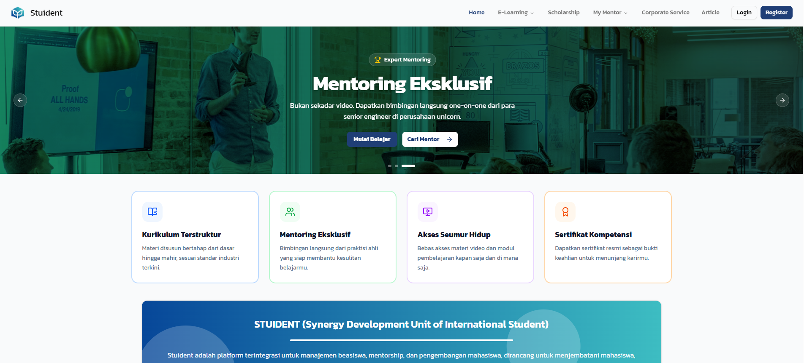
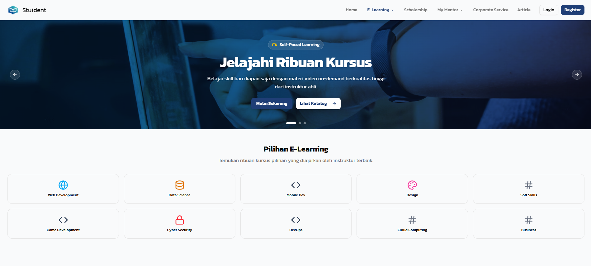

# 🎓 Stuident App – Frontend


**Platform Edukasi Digital by PT Resultan Karya Indonesia**


---

## 📋 Profil Kelompok

| Informasi | Detail |
|-----------|--------|
| **Nama Tim** | Kelompok 2 |
| **Judul PPIDK** | Stuident App PT Resultan Karya Indonesia |

### 👥 Tim Pengembang

| Nama | Peran |
|------|-------|
| **Moh. Misbahul Musthofah** |  Ketua Tim,  Backend |
| Pandu Nugraha Saputra | Backend, Frontend  |
| Muhamad Rizki Ramadhan Siregar |  Frontend, UI Design |
| Al Hadid Aditya Abidin |  Frontend, UI Design |
| Luqy Muhammad Avif |  Frontend |
| Bima Adnandita | Backend, Frontend |
| Ahmad Zidan Ali |  Frontend, UI Design |

---

## 🚀 Tentang Aplikasi

**Stuident** adalah platform edukasi digital yang menyediakan berbagai layanan untuk membantu mahasiswa dan profesional dalam mengembangkan karir mereka. Platform ini dibangun dengan teknologi modern untuk memberikan pengalaman belajar yang optimal.

### ✨ Fitur Utama

- 📚 **E-Learning** – Akses kursus online dengan materi berkualitas
- 🎓 **Scholarship** – Informasi dan pendaftaran beasiswa
- 💼 **Mentoring** – Konsultasi dengan mentor berpengalaman
- 📰 **Artikel** – Baca artikel edukatif terbaru
- 👤 **Profile Management** – Kelola profil dan portfolio
- 📜 **Certificate** – Dapatkan sertifikat setelah menyelesaikan kursus

---

## 🛠️ Tech Stack

### Core Technologies
- **[Vite](https://vite.dev/)** v7.x – Build tool yang cepat
- **[React](https://react.dev/)** v19.x – Library UI
- **[TailwindCSS](https://tailwindcss.com/)** v4.x – Utility-first CSS framework

### UI Components & Libraries
- **[Radix UI](https://www.radix-ui.com/)** – Accessible UI primitives
- **[Lucide React](https://lucide.dev/)** – Beautiful icons
- **[Framer Motion](https://www.framer.com/motion/)** – Animation library
- **[Embla Carousel](https://www.embla-carousel.com/)** – Carousel component

### State Management & Data Fetching
- **[TanStack Query](https://tanstack.com/query/)** v5.x – Server state management
- **[React Hook Form](https://react-hook-form.com/)** – Form handling
- **[Zod](https://zod.dev/)** v4.x – Schema validation

### Routing & HTTP
- **[React Router](https://reactrouter.com/)** v7.x – Client-side routing
- **[Axios](https://axios-http.com/)** – HTTP client

### Utilities
- **[SweetAlert2](https://sweetalert2.github.io/)** – Beautiful alerts
- **[html2canvas](https://html2canvas.hertzen.com/)** & **[jsPDF](https://github.com/parallax/jsPDF)** – PDF generation
- **[React Markdown](https://remarkjs.github.io/react-markdown/)** – Markdown rendering

---

## 📁 Struktur Project

```
stuident/
├── public/              # Static assets
├── src/
│   ├── assets/          # Images, fonts, dll
│   ├── components/      # Reusable components
│   │   ├── admin/       # Admin-specific components
│   │   ├── corporate/   # Corporate-specific components
│   │   ├── dialog/      # Dialog/modal components
│   │   ├── route/       # Route guards (AdminRoute, PrivateRoute)
│   │   ├── scholarship/ # Scholarship components
│   │   ├── section/     # Page sections
│   │   ├── shared/      # Shared components
│   │   ├── skeleton/    # Loading skeletons
│   │   └── ui/          # Base UI components
│   ├── context/         # React Context providers
│   ├── data/            # Static data
│   ├── hooks/           # Custom React hooks
│   ├── layouts/         # Page layouts
│   ├── lib/             # Utility libraries
│   ├── pages/           # Page components
│   │   ├── admin/       # Admin dashboard pages
│   │   ├── article/     # Article pages
│   │   ├── auth/        # Authentication pages
│   │   ├── corporate/   # Corporate dashboard pages
│   │   ├── course/      # Course pages
│   │   ├── profile/     # User profile pages
│   │   └── scholarship/ # Scholarship pages
│   ├── services/        # API service layer
│   │   ├── admin/       # Admin API services
│   │   └── corporate/   # Corporate API services
│   ├── views/           # View components
│   ├── App.jsx          # Main app component
│   ├── main.jsx         # Entry point
│   └── index.css        # Global styles
├── index.html           # HTML template
├── package.json         # Dependencies
├── vite.config.js       # Vite configuration
└── eslint.config.js     # ESLint configuration
```

## 📸 Screenshots


| Halaman Utama | Lerning Page |
|:---:|:---:|
|  |  |

---

---

## 🔗 Routes

### Public Routes
| Route | Deskripsi |
|-------|-----------|
| `/` | Halaman Utama |
| `/e-learning` | Halaman E-Learning |
| `/our-services` | Layanan Kami |
| `/login` | Login |
| `/register` | Registrasi |
| `/article` | Daftar Artikel |
| `/article/:id` | Detail Artikel |
| `/scholarship` | Daftar Beasiswa |
| `/scholarship/show/:id` | Detail Beasiswa |
| `/course/show/:id` | Detail Kursus |

### Protected Routes (Butuh Login)
| Route | Deskripsi |
|-------|-----------|
| `/my-mentor` | Halaman Mentor Saya |
| `/my-mentor/:id` | Detail Mentor |
| `/my-courses/learn/:id` | Halaman Belajar Kursus |
| `/profile/my-profile` | Profil Saya |
| `/profile/my-profile/portfolio` | Portfolio Saya |
| `/profile/my-order-history` | Riwayat Pesanan |
| `/profile/my-enrolled-courses` | Kursus Terdaftar |
| `/profile/my-mentoring-sessions` | Sesi Mentoring |
| `/profile/my-scholarship-applications` | Aplikasi Beasiswa |
| `/scholarship/application/:id` | Form Aplikasi Beasiswa |

### Admin Routes
| Route | Deskripsi |
|-------|-----------|
| `/admin/users` | Kelola Pengguna |
| `/admin/courses` | Kelola Kursus |
| `/admin/courses/:id` | Kelola Kurikulum |
| `/admin/scholarships` | Kelola Beasiswa |
| `/admin/transactions` | Kelola Transaksi |
| `/admin/organizations` | Kelola Organisasi |
| `/admin/articles` | Kelola Artikel |

### Corporate Routes
| Route | Deskripsi |
|-------|-----------|
| `/corporate/scholarships` | Kelola Beasiswa Corporate |
| `/corporate/organizations` | Kelola Organisasi Corporate |
| `/corporate/articles` | Kelola Artikel Corporate |

---

## ⚡ Getting Started

### Prerequisites

- **Node.js** v18+ 
- **npm** atau **yarn** atau **pnpm**

### Installation

1. **Clone repository**
   ```bash
   git clone <repository-url>
   cd stuident
   ```

2. **Install dependencies**
   ```bash
   npm install
   ```

3. **Setup environment** (opsional)
   
   Buat file `.env` jika diperlukan untuk konfigurasi API URL:
   ```env
   VITE_API_URL=http://localhost:8000/api
   ```

4. **Run development server**
   ```bash
   npm run dev
   ```

5. **Buka browser**
   
   Akses `http://localhost:5173`

### Available Scripts

| Command | Deskripsi |
|---------|-----------|
| `npm run dev` | Jalankan development server |
| `npm run build` | Build untuk production |
| `npm run preview` | Preview production build |
| `npm run lint` | Jalankan ESLint |

---

## 📝 Konvensi Kode

### File Naming
- **Components**: PascalCase (contoh: `CourseCard.jsx`)
- **Services**: PascalCase dengan suffix "Service" (contoh: `CourseService.js`)
- **Pages**: PascalCase dengan suffix "Page" (contoh: `HomePage.jsx`)
- **Hooks**: camelCase dengan prefix "use" (contoh: `useAuth.js`)

### Folder Structure
- Komponen yang digunakan di banyak tempat → `components/shared/`
- Komponen UI dasar (Button, Input, dll) → `components/ui/`
- Komponen khusus fitur → `components/<feature>/`

---
### Pembimbing:
Akhmad Arip, S.Kom.
#### 🔗 Link Penting

- **Link Data Mentor**: [Google Sheets](https://docs.google.com/spreadsheets/d/1qrL210j2jMh80hD-4aXON-Fab_s2U12neg5g5-hG0qo/edit?usp=sharing)


### Disajikan Untuk:
- PT Resultan Karya Indonesia


## 📄 License

© 2026 Kelompok 2 – Studi Independen NF Academy
Bekerja sama dengan PT Resultan Karya Indonesia

---


**Made with ❤️ by Kelompok 2 PPIDK**


